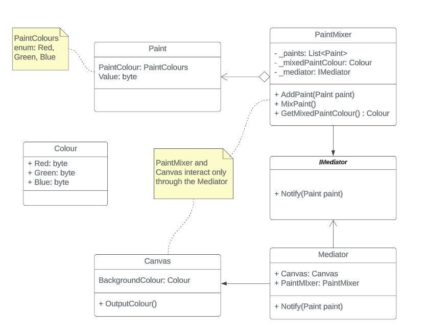

# The Mediator Pattern
The Mediator pattern is a behavioural design pattern which facilitates the communication between components without them needing to know anything about each other or communicate directly with each other.

This pattern helps to reduce dependencies between objects.

## Example
In this example a PaintMixer class allows multiple amounts of red, green or blue paint to be added to it and mixed together. When paint it added it notifies the Mediator.

The Canvas uses the mixed paint and is notified by the Mediator when paint has been added and is given the new paint mix by the mediator.

The solution uses XUnit for unit testing with a CSV file for test data.

## UML
